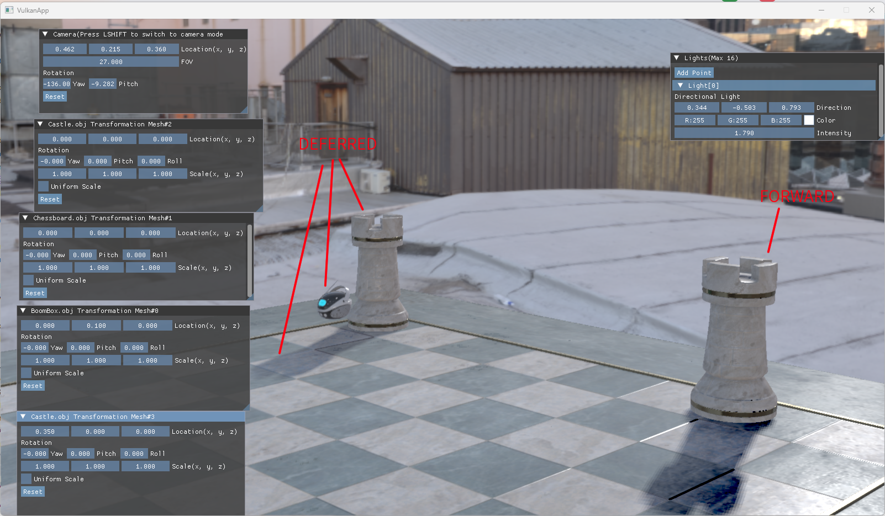
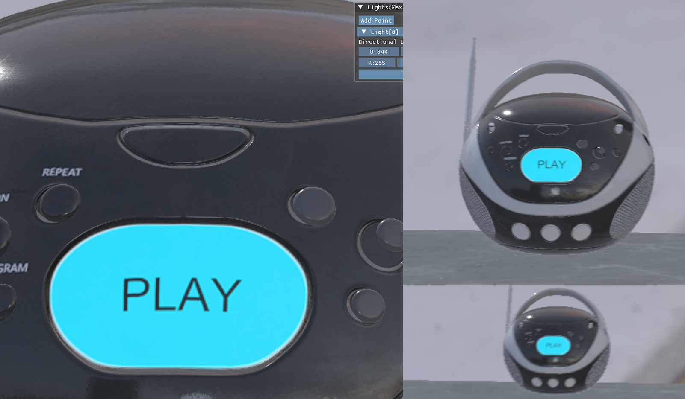
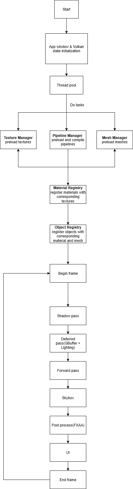

# VRez - A Vulkan Real-Time Rendering App
VRez is a Vulkan-based real-time rendering application inspired by [Haru-V](https://github.com/andyroiiid/Haru-V?tab=readme-ov-file)
##  Features
### Rendering
- **Deferred Rendering** (GBuffer + Lighting Pass)
- **Forward Rendering** 
- **Physically-Based Rendering (PBR)**
    - Directional Light
    - Point Light with range
- **Image-Based Lighting (IBL)**
- **Shadows**
    - Directional Light
- **Skybox Rendering**
- **Post-Processing**
    - FXAA (Fast Approximate Anti-Aliasing)

### Shader System
- Runtime **GLSL → SPIR-V** compilation
- Automatic extraction of **descriptor bindings** and **push constants** from SPIR-V reflection

### Asset System
- **Mesh Manager**
    - Supports loading `.obj` models
- **Texture Manager**
    - Mipmapping & LOD 
- **Material Registry**
    - Maps materials to textures
- **Object Registry**
    - Associates meshes with materials

### Framework
- **Thread Pool** for parallelized asset loading
- **ImGui Integration** for debugging & UI
- **JSON Parsing** with `simdjson` for configuration
- **stb** for image loading
## Screenshots

*
(Deferred + Forward rendering)
*

*
(Texture LOD comparison)
*
## Workflow
Here’s the high-level workflow of the engine:

## Dependencies
+ [SDL](https://github.com/libsdl-org/SDL) - Window and input management
+ [SPIRV-Reflect](https://github.com/KhronosGroup/SPIRV-Reflect) - Shader reflection
+ [glm](https://github.com/g-truc/glm) - Math library
+ [glslang](https://github.com/KhronosGroup/glslang) - GLSL to SPIR-V compiler
+ [ImGui](https://github.com/ocornut/imgui) - UI framework
+ [simdjson](https://github.com/simdjson/simdjson/tree/master) - Fast JSON parser
+ [stb](https://github.com/nothings/stb) -Texture loading
+ [tinyobjloader](https://github.com/tinyobjloader/tinyobjloader) – Mesh loading
## Reference
+ [Haru-V](https://github.com/andyroiiid/Haru-V?tab=readme-ov-file)
+ [Learn OpenGL](https://learnopengl.com/)
+ [Vulkan Tutorial](https://vulkan-tutorial.com/)
+ [Khronos Vulkan® Tutorial](https://docs.vulkan.org/tutorial/latest/00_Introduction.html)
+ [Vulkan Guide](https://vkguide.dev/)
+ [NVIDIA FXAA - TIMOTHY LOTTES](https://developer.download.nvidia.com/assets/gamedev/files/sdk/11/FXAA_WhitePaper.pdf)
